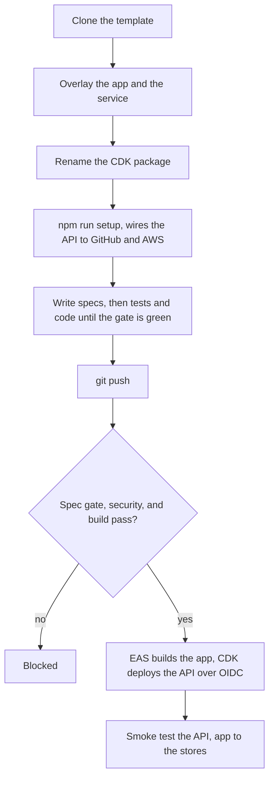
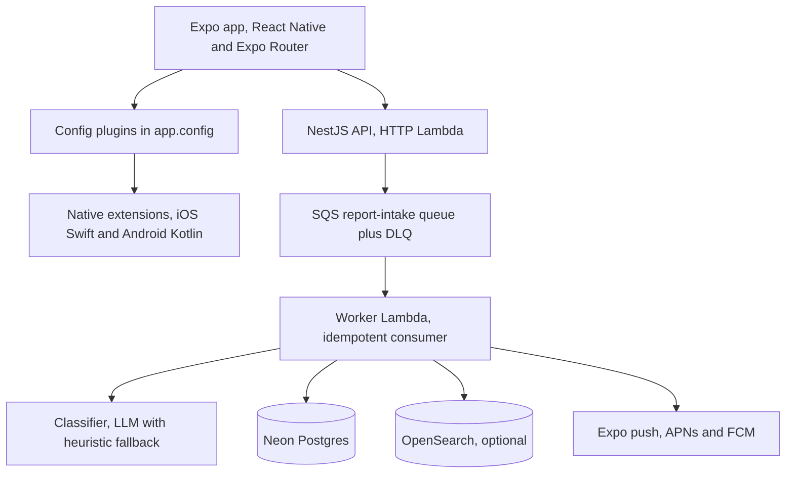
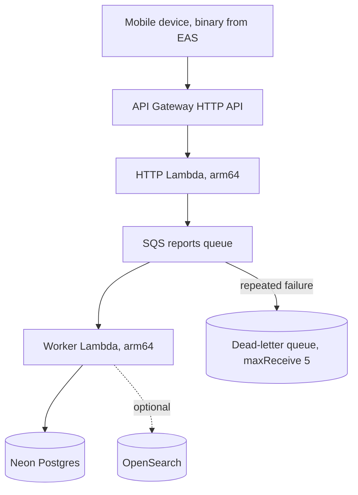

# Mobile Platform System Design

> A system design breakdown of mobile-platform, the mobile sibling of the web platform template. Point an AI coding agent at it, describe an idea, and it ships a real, live Expo app plus a NestJS API to AWS, with native call and SMS interception, async report intake, keyless deploys, and a spec gate that proves even the OS-level behaviour. The system being designed here is the framework itself.
>
> **Live demos and the full story** at https://elleskay.github.io/platform-site/
>
> The web sibling, for web-only apps, is [platform](https://github.com/elleskay/platform).

---

## Understanding the Problem

Mobile makes the trust problem harder than web. An agent can write the app and the API, but two things resist proof: the most valuable features, blocking a scam call or filtering a scam text, run in the phone's operating system where no JavaScript test can reach them, and there is a backend to stand up. Mobile-platform is a template an agent clones per app, inheriting an Expo app, a NestJS API on AWS, and a gate that proves both the code and the native behaviour, or fails.

The defining constraint is proving what the test runner cannot run. OS-level behaviour must be verifiable, async work must be reliable, deploys must carry no stored keys, and one honest gate must span four different test runners. Everything else follows from that.

### Functional Requirements

- An agent should be able to scaffold an app, a service, and the infra, and ship the app through EAS and the API to AWS.
- Native call blocking and SMS filtering should be surfaced through config plugins, with the OS doing the interception.
- A single construct call should deploy the API as an HTTP Lambda with an SQS report-intake queue, a dead-letter queue, an idempotent worker, and optional OpenSearch.
- The spec gate should cover every requirement with a passing asserting test or a fresh signed real-device artifact.
- One command should wire the API's keyless cloud connection.
- The template should dogfood itself through a demo app and service.

Design choices, deliberately out of scope: the API is serverless only, the infra is copied not imported, and this template is mobile and NestJS, with web-only concerns living in the web sibling.

### Non-Functional Requirements

- OS-level behaviour must be provable even though JavaScript tests cannot run it.
- Async report intake should be reliable, with retries, a dead-letter path, and idempotent processing.
- Deploys should carry zero long-lived AWS credentials, on a least-privilege role.
- One test gate should span all four runners and be honest about what it cannot catch.
- Each app should be self-contained, so a foundation change never propagates without an explicit pull.
- The serverless API should cost near zero when idle.

---

## The Set Up

### Planning the Approach

Mobile-platform is one half of a two-template family, mobile and NestJS here, web in the sibling. You clone it per app and copy the pieces in rather than importing them, so a breaking change lands only when an app pulls it. Native call and SMS features are wired through Expo config plugins so the managed workflow is kept and the native code stays declarative. And because the headline features run in the OS, the spec system has a verify level that decides what counts as proof, with OS-level requirements proven by signed real-device evidence rather than a test.

The service is a scaffold, not a finished backend. It ships the API surface, the SQS and worker wiring, the classifier with its heuristic fallback, and health, and it leaves the persistence and the server-side JWT issuing as per-app work. A real app on the template, such as ScamShield, fills those in. The architecture below is what such an app looks like once it does.

### Defining the Core Entities

The pieces of the framework.

- **Expo app overlay**, the app with config plugins and native references (iOS Swift, Android Kotlin).
- **NestJS service scaffold**, the API with health, reports, classifier, and the SQS consumer.
- **NestjsApi construct**, one CDK call that deploys an HTTP Lambda behind API Gateway, an SQS report-intake queue with a dead-letter queue, an idempotent worker Lambda, and an optional OpenSearch domain.
- **spec-test package**, a runner dual-published as ESM and CJS, the coverage gate, the ESLint no-empty-assertion rule, and the artifact tools spec-attest and verify-attestations.
- **Workflows**, five of them: ci, security, mobile build, API deploy, and an optional web export.
- **Setup** (scripts/connect.sh), the **least-privilege IAM policy**, and the **demo app and service** that self-test the foundation.

### API or System Interface

The framework's surface is a construct, a spec gate that spans four runners, and a few commands.

```
The construct (one call deploys the API)
  new NestjsApi(stack, "Api", { ... })
    wires API Gateway, an HTTP Lambda, an SQS queue plus DLQ, an idempotent worker, and optional OpenSearch

The spec gate (one record, four runners)
  specTest("[APP-DOMAIN-NNN] title", fn)        bind a test to a requirement, any runner
  verify levels                                 unit and component via jest-expo, api via Vitest,
                                                e2e via Maestro, native and manual via signed artifacts
  spec-attest / verify-attestations             stamp and check the signed real-device artifacts
  spec-coverage                                 the gate, exits nonzero on any gap

Setup, build, and deploy
  npm run setup        wire the API to GitHub and AWS (OIDC role, database, secrets), idempotent, --dry-run
  npm run test:spec    run every runner and the gate
  EAS build / submit / update    build, submit, and OTA-update the app
```

---

## High-Level Design

We build the design one functional requirement at a time.

### 1) An agent scaffolds the app, service, and infra, and ships

You clone the template, overlay the app and the service, rename the CDK package, run one setup command, write the spec and the tests and code until the gate is green, and push. The app ships through EAS, the API deploys to AWS over OIDC.



### 2) Native call and SMS are surfaced through config plugins

The app manages data in JavaScript, but the interception runs out of process in the OS. Expo config plugins inject the iOS Call Directory and Message Filter and the Android CallScreeningService at prebuild, so the managed workflow is kept and the native code is declarative. SMS filtering is the iOS Message Filter, and on Android the call screening is the CallScreeningService.



### 3) The API takes reports asynchronously

The HTTP Lambda accepts a report and returns fast, handing the slow work to a queue. A worker Lambda drains it idempotently, classifies, persists, and pushes, with a dead-letter queue catching repeated failures. The NestjsApi construct wires this once for every app.



### 4) The gate proves every requirement, code and native alike

Tests across four runners record to one coverage record that a single gate reads, and OS-level requirements are proven by signed real-device artifacts. The gate fails on a missing test, a failing test, an assertion-free test, a requirement proven in the wrong layer, or a native artifact that is missing, unsigned, tampered, or stale.

---

## Potential Deep Dives

### 1) How do we prove OS-level behaviour that JavaScript tests cannot run?

Call blocking and SMS filtering run out of process in the OS, so no app test can exercise them, yet a 100 percent gate would claim they are covered.

<details>
<summary><strong>Bad solution: mark them covered and hope</strong></summary>

Tag the native requirements as covered with no real check. The gate lies, and a broken block or filter ships unnoticed.
</details>

<details>
<summary><strong>Good solution: manual QA each release</strong></summary>

A person tests on a real device before each release and notes it. Real evidence, but unenforced, untied to the build, and easy to skip.
</details>

<details>
<summary><strong>Great solution: signed, freshness-checked real-device artifacts</strong></summary>

Prove those requirements with committed real-device artifacts under verification/, carrying an in-file sha256 so tampering is caught, on a commit signed by an allowed signer for accountability, and going stale on an app-version bump, an OS-baseline drift, or a 90-day TTL. The gate evaluates them, so native behaviour cannot ship on missing, unsigned, tampered, or stale evidence. This is what mobile-platform runs.
</details>

### 2) How do we add native call and SMS code without ejecting?

Expo's managed workflow does not include the native call and SMS extensions, but ejecting to edit them by hand is costly.

<details>
<summary><strong>Bad solution: eject to the bare workflow</strong></summary>

Eject and hand-edit the ios and android directories. You lose the managed workflow and OTA updates, and the native edits are easy to lose when the projects regenerate.
</details>

<details>
<summary><strong>Good solution: patch the native files after prebuild</strong></summary>

Run a script that patches the generated native projects each prebuild. Better, but the patch drifts as the native projects change and breaks silently.
</details>

<details>
<summary><strong>Great solution: Expo config plugins</strong></summary>

Config plugins inject the iOS Call Directory and Message Filter and the Android CallScreeningService at prebuild, declaratively. The managed workflow stays, the native code lives as referenced sources, and the JS layer only manages data while the OS does the interception. This is what mobile-platform runs.
</details>

### 3) How do we keep one honest gate across four test runners?

The app and API are tested by jest-expo, Vitest, and Maestro, plus native artifacts, and each could report coverage its own way.

<details>
<summary><strong>Bad solution: each runner reports its own coverage</strong></summary>

Let every runner emit coverage in its own format. There is no single source of truth, and it is easy to show coverage in one runner that does not reflect the requirements.
</details>

<details>
<summary><strong>Good solution: a shared naming convention by hand</strong></summary>

Agree that tests name themselves with the requirement id. Better, but nothing enforces it and the runners still do not agree on a record format.
</details>

<details>
<summary><strong>Great solution: one runner, dual-published, one record</strong></summary>

Ship one spec-test runner, published as both ESM and CJS so Vitest, jest-expo, Maestro, and the CLIs all consume it, each recording to one coverage record. A single gate reads that record and checks every requirement has a passing, asserting test in the right layer. It is also honest about its limits, a wrong spec, unspecced behaviour, and decomposed-journey gaps are not caught, which is why a journey-level Maestro e2e per feature is required. This is what mobile-platform runs.
</details>

### 4) How do we accept a report reliably without blocking the user?

Classifying and storing a report is slow work that should not sit on the request path or be lost on failure.

<details>
<summary><strong>Bad solution: do it inline in the request</strong></summary>

Classify and persist inside the HTTP request. The user waits, and any failure loses the report.
</details>

<details>
<summary><strong>Good solution: a background thread</strong></summary>

Return fast and finish in the background. But the Lambda can freeze the moment the response is sent, dropping the work.
</details>

<details>
<summary><strong>Great solution: a queue, an idempotent worker, and a DLQ</strong></summary>

The HTTP Lambda enqueues to SQS and returns fast, an idempotent worker Lambda drains it, and a dead-letter queue catches anything that fails five times. The NestjsApi construct wires this once for every app, so reliable intake is inherited, not rebuilt. This is what mobile-platform runs.
</details>

### 5) How do we run a mobile end-to-end test in CI without a Metro server?

A debug build loads its JavaScript from a Metro dev server that does not run on a CI emulator.

<details>
<summary><strong>Bad solution: build a debug APK in CI</strong></summary>

Build the usual debug APK. It expects a Metro server to serve its bundle, which is not running on the CI emulator, so the app never starts.
</details>

<details>
<summary><strong>Good solution: run Metro in CI</strong></summary>

Start a Metro server alongside the emulator. Heavy and flaky to coordinate, and slow.
</details>

<details>
<summary><strong>Great solution: a release APK driven by Maestro</strong></summary>

Build a release APK with the JavaScript bundled in, and drive it with Maestro on a KVM Android emulator on free Linux runners, no Metro and no macOS runner needed. The choice is recorded in ADR 0001. This is what mobile-platform runs.
</details>

---

## Tech stack

| Layer | Tech |
|---|---|
| App | Expo and React Native, Expo Router, TypeScript strict |
| Native | iOS Call Directory and Message Filter (Swift), Android CallScreeningService (Kotlin), via config plugins |
| API | NestJS (TypeScript strict) on AWS Lambda and API Gateway HTTP API |
| Validation | class-validator on every DTO |
| Auth | the client stores a JWT in expo-secure-store, an app issues it |
| Data | a Neon Postgres connection wired by setup, persistence added per app |
| Messaging | AWS SQS report intake with a dead-letter queue, an idempotent worker |
| Search | OpenSearch, optional, for clustering similar reports |
| Classifier | an LLM endpoint with a deterministic heuristic fallback |
| Push | Expo push, APNs and FCM |
| IaC | AWS CDK, the reusable NestjsApi construct, copied per app |
| App build | EAS Build, Submit, and Update |
| API deploy | GitHub Actions and CDK over OIDC, no stored keys |
| Testing | spec-test over Vitest, jest-expo, Maestro, and signed real-device artifacts |
| Tooling | ESLint 9, Prettier, Commitlint, Node 20+ |

## License

MIT.
