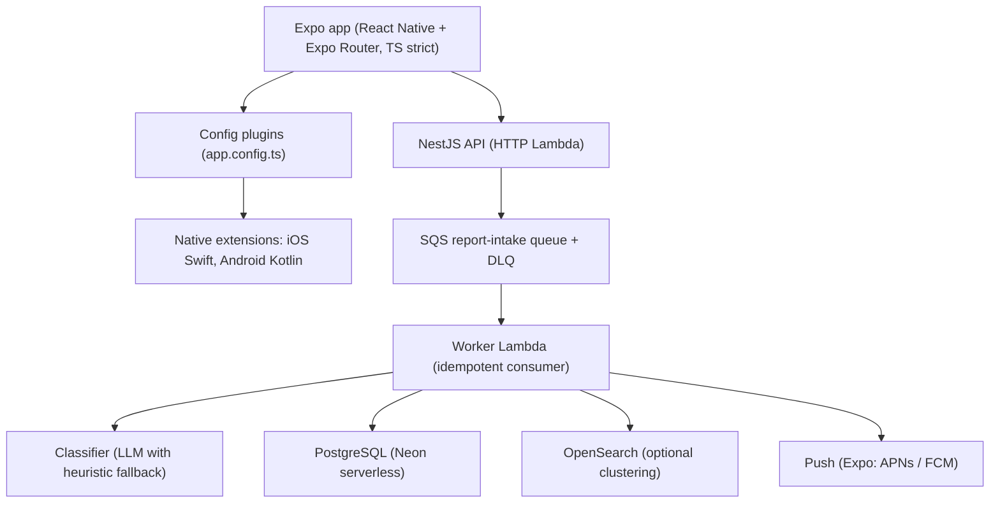
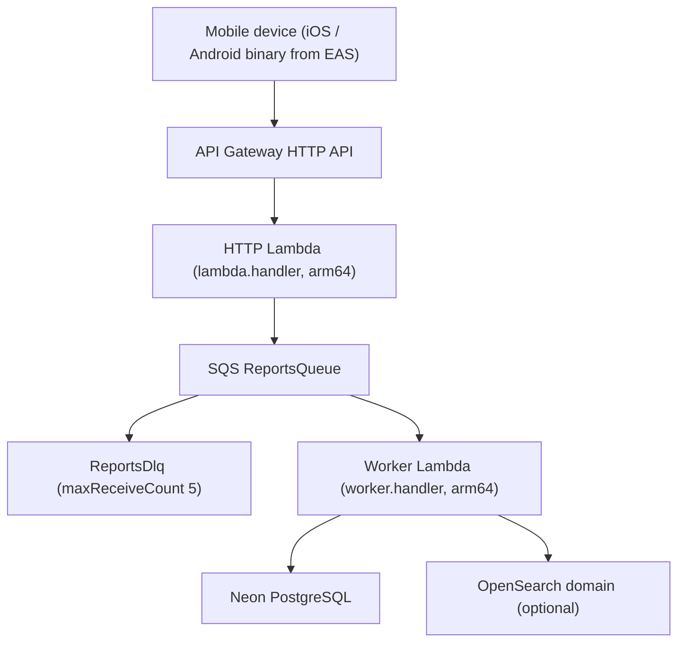
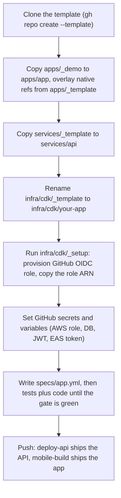
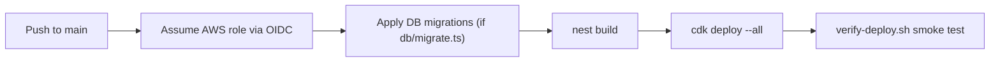
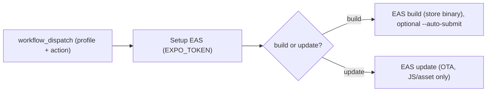

# mobile-platform

A TypeScript platform template for shipping React Native (Expo) apps backed by a NestJS API on AWS serverless. You clone it, drop in your app and your service, and you inherit CI, infrastructure-as-code, security scanning, a verified deploy pipeline, native call/SMS module references, and a spec-driven test gate that refuses to ship an app whose requirements are not proven. A working demo app and demo API live inside and are built by the same workflows, so the patterns are tested on every push, not just documented.

Repo: [elleskay/mobile-platform](https://github.com/elleskay/mobile-platform). License: MIT.

This is the mobile sibling of a web `platform` template. Mobile and NestJS belong here; web-only concerns live in the other one. It is modeled on the real ScamShield stack (a citizen-facing iOS/Android app with call blocking, SMS filtering, check-and-report, push, SQS report intake, and OpenSearch clustering), and ScamShield-style apps are built on it. It is designed to be cloned per app, not vendored as a dependency: each app pins its own copy of the constructs and the test runner, so a breaking change never propagates without an explicit action.

## Demo: the platform tests itself

There is no hosted UI to show; the proof is in the pipeline. CI builds the demo Expo app, builds the demo NestJS service, synthesizes the CDK construct against that service, and runs the spec gate against itself on every push. A deployed API can then be smoke-tested end to end.

CDK synth proving the `NestjsApi` construct bundles the demo service:

```text
$ cd infra/cdk/_template && npx cdk synth
> nest build
Bundling NestJS service for Lambda (tsc output + production node_modules)...
Successfully synthesized to cdk.out
Stacks: DemoApiStack
  AWS::ApiGatewayV2::Api        HttpApi
  AWS::Lambda::Function         HttpFunction   (lambda.handler,  arm64, 512 MB)
  AWS::Lambda::Function         WorkerFunction (worker.handler,  arm64, 1024 MB)
  AWS::SQS::Queue               ReportsQueue + ReportsDlq
```

Post-deploy smoke test (`scripts/verify-deploy.sh`), which proves routing, DI, validation, and the queue path are actually live:

```text
$ ./scripts/verify-deploy.sh https://abc123.execute-api.ap-southeast-1.amazonaws.com
==> Health endpoint
  PASS  Health endpoint
==> POST /reports/check classifies
  PASS  POST /reports/check classifies
==> Validation rejects empty body (400)
  PASS  Validation rejects empty body (400)
==> Unknown fields rejected (400)
  PASS  Unknown fields rejected (400)
==> POST /reports returns a reportId
  PASS  POST /reports returns a reportId
==> No secret material leaked
  PASS  No secret material leaked

Summary: 6 passed, 0 failed
```

## What it does

- Ships a per-app clone target, not a dependency: an Expo app overlay, a NestJS service scaffold, a CDK package, and a one-time AWS setup stack, all copied and renamed per app.
- Surfaces native call blocking and SMS filtering through Expo config plugins: iOS Call Directory and Message Filter extensions (Swift), Android CallScreeningService and SMS role (Kotlin). The JS layer manages data; the OS does the interception.
- Provides a reusable `NestjsApi` CDK construct: HTTP Lambda behind API Gateway, an SQS report-intake queue with a dead-letter queue, an idempotent worker Lambda, and an optional OpenSearch domain for clustering similar reports.
- Runs four GitHub Actions workflows out of the box: CI (typecheck, lint, expo-doctor, nest build, cdk synth, spec gate), security (CodeQL, gitleaks, npm audit), mobile build (EAS build, submit, and OTA update), and API deploy (OIDC, CDK deploy, smoke test).
- Enforces a spec-driven test gate: every requirement in a YAML spec must be covered by a passing, asserting test or a fresh signed real-device artifact, or the build fails.
- Ships least-privilege IAM (a pre-canned deploy policy and an OIDC role) so the deploy role is never `AdministratorAccess`.
- Dogfoods all of the above through `apps/_demo/` and `services/_template/`, built by the same workflows an app inherits.

## Logical architecture



The native extensions run out of process and intercept calls/SMS at the OS level; the app reaches them only through documented config-plugin extension points.

## Physical architecture

What one app deployed on the `NestjsApi` construct looks like in AWS:



## Clone to a shipped app and API



## Deployment pipelines

Two independent pipelines: the API deploys from `main`, the app builds on demand through EAS.





OTA updates ship JS and asset changes only. Anything touching native code (a new permission, a new extension) needs a full store build, not an OTA push.

## Spec-driven development

Every app on this platform is built from a spec and tested against it. The first artifact for any app is `specs/<app>.yml`: each requirement gets a unique ID, a category, a severity, a `verify` level, and a given/when/then. Tests then name themselves with the requirement ID in brackets; a per-runner recorder parses the `[ID]` and records pass or fail. The runner is `@platform/spec-test`, dual-published as ESM and CJS so Vitest (API), jest-expo (app unit and component), Maestro (app e2e), and Node CLIs all consume it.

A sample requirement from the app overlay spec (`apps/_template/specs/example.yml`):

```yaml
- id: EX-CHECK-001
  title: User can check a suspicious message and see a verdict
  category: functional
  verify: e2e
  platforms: [ios, android]
  severity: high
  given: the user is on the Check screen
  when: they paste a message containing a link and a lure word, then tap Check
  then: a SCAM or SUSPICIOUS verdict is shown with a reason
  tags: [check-and-report]
```

The gate (`spec-coverage`) parses the spec, reads the coverage record, evaluates any native/manual signed artifacts, writes a markdown report, and exits non-zero on any gap. Green looks like this:

```text
# Spec coverage: example v1

**100% covered** (3/3 requirements passed at least one test)

All requirements covered by passing tests.
```

Red, when a requirement has no passing test:

```text
# Spec coverage: example v1

**66.7% covered** (2/3 requirements passed at least one test)

## Uncovered (1)

| ID         | Title                                          | Category | Severity |
|------------|------------------------------------------------|----------|----------|
| EX-UI-001  | Dropdown renders combobox with provided options | ui       | high     |
```

What the gate catches: a missing test (uncovered, exit 1), a covering test that fails (exit 1), a `[ID]` test with zero `expect()` calls (an ESLint rule fails before tests even run), a requirement proven in the wrong layer (category mismatch, exit 1), and a `native`/`manual` requirement whose signed artifact is missing, unsigned, tampered, or stale (exit 1).

OS-level behavior (call blocking, SMS filtering) cannot have a JS test because the interception runs out of process. Those `verify: native | manual` requirements are proven instead by signed real-device artifacts under `verification/`, with two layers of protection: an in-file `sha256` checksum stamped by `spec-attest` (integrity: editing the body after stamping is caught as tampered), and the GPG/SSH signature on the commit that last touched the artifact, by a signer in `allowed-signers` (accountability, enforced by `scripts/verify-attestations.sh`). The moment any artifact carries a signature, an empty `allowed-signers` becomes a hard error, so accountability cannot be left off by forgetting. Artifacts go stale when the app version moves, when the tested OS falls behind `os-baseline.yml`, or after a 90-day TTL, forcing real-device re-verification.

What the gate does not catch, stated honestly: a wrong spec (the test agrees with a wrong requirement), behavior nobody wrote a spec entry for, and decomposed-journey gaps (a feature split across IDs can hit 100% coverage while one link in the user chain is broken). The mitigation for the last is at least one journey-level Maestro e2e per user-facing feature, plus the native artifact layer. See `docs/TESTING.md` and `docs/adr/0001-testing-architecture.md`.

## Tech stack

| Area | Choice |
|---|---|
| App | Expo (React Native) + Expo Router, TypeScript strict |
| Native modules | iOS Call Directory + Message Filter (Swift), Android CallScreeningService + SMS (Kotlin), via config plugins |
| API | NestJS (TypeScript strict) on AWS Lambda + API Gateway HTTP API |
| Validation | class-validator on every controller DTO; Zod where a schema is shared with the app |
| Auth | JWT access tokens issued by the API, stored on device in expo-secure-store |
| Data | PostgreSQL (Neon serverless) |
| Messaging | AWS SQS (report intake) + dead-letter queue |
| Search | OpenSearch (optional, clustering similar reports) |
| Classifier | LLM endpoint with a deterministic heuristic fallback |
| Push | Expo push (APNs / FCM) |
| IaC | AWS CDK (reusable `NestjsApi` construct + per-app package) |
| App build/deploy | EAS Build / Submit / Update |
| API deploy | GitHub Actions + CDK over GitHub OIDC (no stored AWS keys) |
| Test runner | `@platform/spec-test` (Vitest, jest-expo, Maestro, signed artifacts) |
| Tooling | ESLint 9, Prettier, Commitlint (Conventional Commits), Node 20+ |

## Local development

This is a npm workspaces monorepo (`apps/*`, `services/*`, `packages/*`).

```bash
npm ci                      # install the whole workspace

# Demo app
cd apps/_demo
npm run typecheck
npm start                   # expo start

# Demo API
cd services/_template
npm run build               # nest build
npm run start:dev           # local HTTP on :3000

# Spec-test runner
cd packages/spec-test
npm run build               # dual ESM + CJS
```

Native call/SMS features require `expo prebuild` and a full native build; the references in `apps/_template/native/` are copied in via config plugins, not committed as generated `ios/`/`android/` dirs. See `docs/MOBILE.md`.

## Testing

- Unit and component (app): jest-expo, recorded through `@platform/spec-test/jest`.
- API: Vitest, recorded through `@platform/spec-test/vitest`.
- End-to-end (app): Maestro flows, ingested into coverage by `spec-maestro`.
- Native/manual: signed real-device artifacts under `verification/`, verified by `spec-attest` and `scripts/verify-attestations.sh`.
- The gate (`spec-coverage`) ties them together and is what `npm run test:spec` runs in a cloned app. CI runs the gate against the runner's own samples to prove the pass and fail paths both behave.

Android e2e in CI builds a release APK (not debug), because a debug build loads its JS bundle from a Metro dev server that does not run on a CI emulator. See `docs/TESTING.md` and `docs/adr/0001-testing-architecture.md`.

## Deployment

API: push to `main`. The deploy workflow assumes an AWS role over GitHub OIDC (no stored credentials), applies DB migrations if present, builds the service, runs `cdk deploy`, and smoke-tests the live URL. Configure the role once with the setup stack:

```bash
cd infra/cdk/_setup
npm install
npx cdk deploy -c repo=<owner>/<your-app>   # outputs the role ARN
```

Copy the role ARN into the repo's GitHub Actions secret `AWS_DEPLOY_ROLE_ARN`, attach the least-privilege policy from `infra/iam/cdk-deploy-policy.json`, and set the remaining secrets and variables (DB, JWT, EAS token) per `docs/SETUP.md` and `docs/DEPLOY.md`.

App: run the Mobile build workflow (`workflow_dispatch`) to EAS build (and optionally submit) a store binary, or to ship a JS-only OTA update. See `docs/MOBILE.md`.

A note on data: PostgreSQL (via Neon) is the supported database, but this template ships no fixed business schema. The reports domain models the ScamShield-style intake path, not a canonical table layout; an app cloned from here defines its own schema and migrations (`db/migrate.ts`, which the deploy workflow runs before the new Lambda goes live). For that reason there is no entity-relationship diagram here: there is no persistent schema to draw.

## Repository structure

```text
apps/
  _template/            Expo app overlay: config plugins, native refs, lib, specs, tests, verification
    native/             iOS Swift + Android Kotlin call/SMS extension references
    plugins/            Expo config plugins that wire the native extensions
    specs/              Per-app spec YAML
    tests/              jest-expo (unit + component) + Maestro scaffolding
    verification/       Signed real-device artifacts for native/manual requirements
  _demo/                Working demo Expo app (platform self-test)
services/
  _template/            Full NestJS service: health, reports, classifier, SQS consumer, OpenSearch
    src/lambda.ts       HTTP Lambda handler (serverless-express)
    src/worker.ts       SQS worker entry (root re-export of the reports consumer)
infra/
  cdk/_template/        CDK package, includes lib/constructs/NestjsApi.ts
  cdk/_setup/           One-time GitHub OIDC + IAM role stack
  iam/                  Least-privilege deploy policy JSON
packages/
  spec-test/            @platform/spec-test: spec runner, coverage gate, ESLint rule, CLIs
scripts/                verify-deploy.sh, verify-attestations.sh
.github/workflows/      ci, security, mobile-build, deploy-api
docs/                   SETUP, DEPLOY, MOBILE, TESTING, SSDLC, adr/
```

## License

MIT. Copyright (c) 2026 elleskay.
</content>
</invoke>
