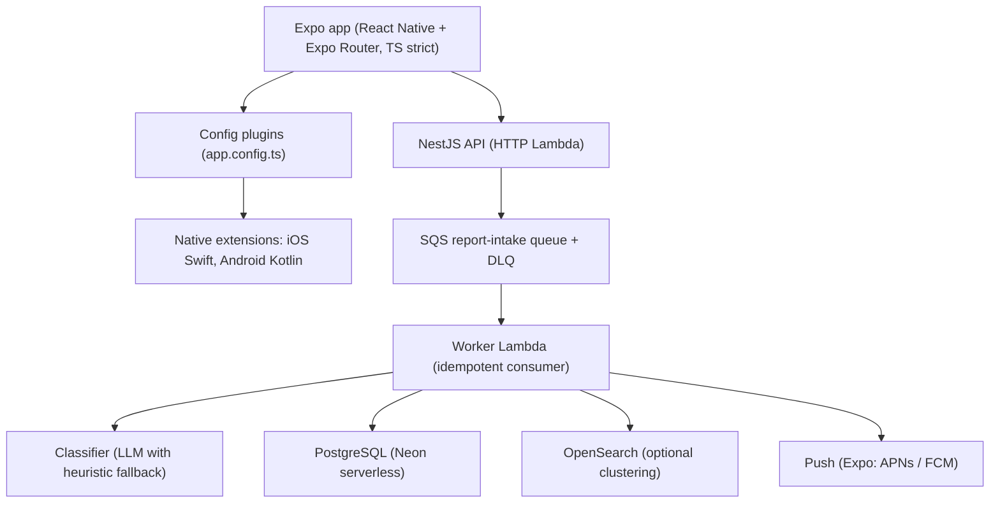
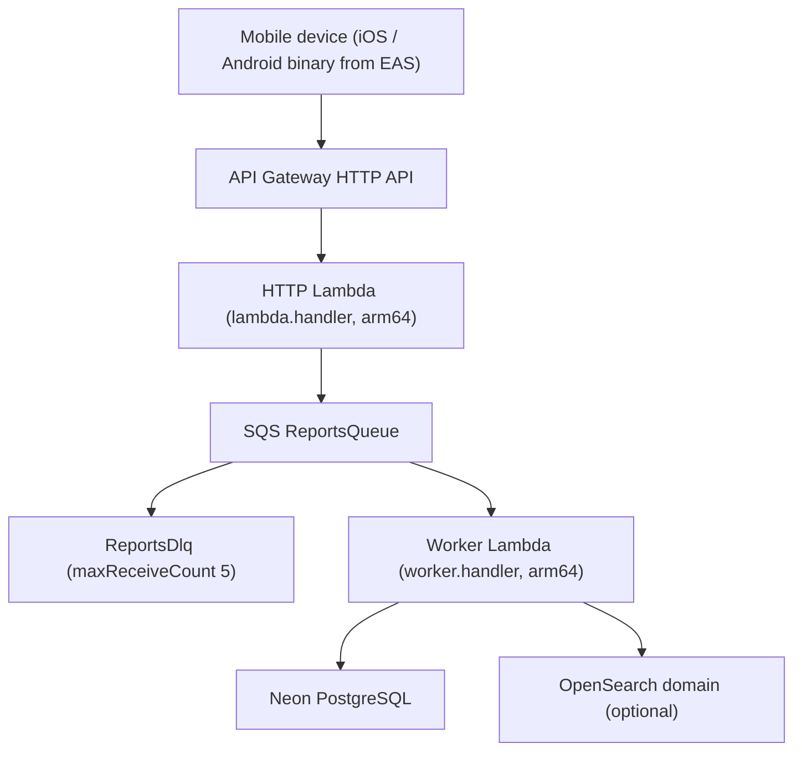

<div align="center">

# Ship production-grade apps, fast.

### the mobile template &middot; Expo (React Native) + NestJS on AWS

**Open-source Expo and NestJS on AWS template your AI coding agent can deploy to.** Point it at this repo, describe an idea, and it ships a real, live app, with no infrastructure to build.

`Works with` &nbsp; **Claude Code** &nbsp;·&nbsp; **Codex** &nbsp;·&nbsp; **Cursor** &nbsp;·&nbsp; **Windsurf** &nbsp;·&nbsp; **Cline**

[](https://github.com/elleskay/mobile-platform/actions/workflows/ci.yml) &nbsp;[](https://github.com/elleskay/mobile-platform/actions/workflows/security.yml) &nbsp; &nbsp; &nbsp;[](LICENSE)

### [Live demos and the full story: elleskay.github.io/platform-site](https://elleskay.github.io/platform-site/)

`spec-driven gate` &nbsp;·&nbsp; `0 stored keys` &nbsp;·&nbsp; `native call/SMS` &nbsp;·&nbsp; `MIT`

</div>

Clone it, drop in your app and your service, and inherit CI/CD, infrastructure as code, security scanning, native call/SMS module references, OIDC deploys with zero stored credentials, and a spec-driven test gate that refuses to ship an app whose requirements are not proven.

## The two-template family

This is the mobile sibling of the web [**platform**](https://github.com/elleskay/platform) template. Mobile and NestJS belong here; web-only concerns live in the other one. The [**live showcase**](https://elleskay.github.io/platform-site/) features the whole family, the apps below plus the web ones, all openable right now.

A full reconstruction of Singapore's **ScamShield** runs on this template: a React Native app, a NestJS API on AWS, a Postgres store, and an admin verification dashboard, with call blocking, SMS filtering, check-and-report, push, SQS report intake, and OpenSearch clustering. Try the [web build](https://elleskay.github.io/scamshield/) or read the [repo](https://github.com/elleskay/scamshield). CI also builds the demo Expo app and NestJS service and runs the spec gate against the construct on every push.

## Built to pair with an AI coding agent

Point Claude Code, Codex, Cursor, Windsurf, or Cline at this repo and describe an app: it scaffolds the app, the service, and the infra from the templates, builds, and ships. The agent conventions live in [CLAUDE.md](CLAUDE.md), including a mandatory spec-first build protocol.

One command wires the API's cloud connection so every push deploys with no stored keys:

```bash
npm run setup          # scripts/connect.sh
npm run setup -- --dry-run   # preview without changing anything
```

It ensures the GitHub OIDC provider, deploys a least-privilege deploy role, provisions a database, generates `JWT_SECRET`, and sets every GitHub Actions secret and variable. The agent guides you through the interactive steps (database choice, and EAS login for the app), the AWS/GitHub half is automated.

## What it does

- Ships a per-app clone target, not a dependency: an Expo app overlay, a NestJS service scaffold, a CDK package, and a one-time AWS setup stack, all copied and renamed per app. Each app pins its own copy, so a breaking change never propagates without explicit action.
- Surfaces native call blocking and SMS filtering through Expo config plugins: iOS Call Directory and Message Filter extensions (Swift), Android CallScreeningService and SMS role (Kotlin). The JS layer manages data; the OS does the interception.
- Provides a reusable `NestjsApi` CDK construct: HTTP Lambda behind API Gateway, an SQS report-intake queue with a dead-letter queue, an idempotent worker Lambda, and an optional OpenSearch domain.
- Runs four GitHub Actions workflows: CI (typecheck, lint, expo-doctor, nest build, cdk synth, spec gate), security (CodeQL, gitleaks, npm audit), mobile build (EAS build, submit, OTA update), and API deploy (OIDC, CDK deploy, smoke test).
- Enforces a spec-driven test gate: every requirement is covered by a passing, asserting test or a fresh signed real-device artifact, or the build fails.
- Ships least-privilege IAM (a deploy policy and an OIDC role) so the deploy role is never `AdministratorAccess`.
- Dogfoods all of the above through `apps/_demo/` and `services/_template/`, built by the same workflows an app inherits.

## Logical architecture



The native extensions run out of process and intercept calls/SMS at the OS level; the app reaches them only through documented config-plugin extension points.

## Physical architecture

What one app deployed on the `NestjsApi` construct looks like in AWS:



## Spec-driven development

Every app on this platform is built from a spec and tested against it. The first artifact for any app is `specs/<app>.yml`: each requirement gets a unique ID, a category, a severity, a `verify` level, and a given/when/then. Tests name themselves with the requirement ID in brackets; a per-runner recorder parses the `[ID]` and records pass or fail. The runner is `@platform/spec-test`, dual-published as ESM and CJS so Vitest (API), jest-expo (app unit and component), Maestro (app e2e), and Node CLIs all consume it.

The gate (`spec-coverage`) parses the spec, reads the coverage record, evaluates any native/manual signed artifacts, and exits non-zero on any gap. It catches a missing test, a covering test that fails, a `[ID]` test with zero `expect()` calls (an ESLint rule fails before tests run), a requirement proven in the wrong layer, and a `native`/`manual` requirement whose signed artifact is missing, unsigned, tampered, or stale.

OS-level behavior (call blocking, SMS filtering) cannot have a JS test, because the interception runs out of process. Those `verify: native | manual` requirements are proven instead by signed real-device artifacts under `verification/`, with two layers: an in-file `sha256` stamped by `spec-attest` (tampering is caught), and the GPG/SSH signature on the commit that last touched the artifact (accountability, enforced by `scripts/verify-attestations.sh`). Artifacts go stale on app-version bumps, OS baseline drift, or a 90-day TTL, forcing real-device re-verification.

What the gate does not catch, stated honestly: a wrong spec, behavior nobody wrote a spec entry for, and decomposed-journey gaps. The mitigation for the last is at least one journey-level Maestro e2e per user-facing feature, plus the native artifact layer. See `docs/TESTING.md` and `docs/adr/0001-testing-architecture.md`.

## Tech stack

| Area | Choice |
|---|---|
| App | Expo (React Native) + Expo Router, TypeScript strict |
| Native modules | iOS Call Directory + Message Filter (Swift), Android CallScreeningService + SMS (Kotlin), via config plugins |
| API | NestJS (TypeScript strict) on AWS Lambda + API Gateway HTTP API |
| Validation | class-validator on every controller DTO; Zod where a schema is shared with the app |
| Auth | JWT access tokens issued by the API, stored on device in expo-secure-store |
| Data | PostgreSQL (Neon serverless) |
| Messaging | AWS SQS (report intake) + dead-letter queue |
| Search | OpenSearch (optional, clustering similar reports) |
| Classifier | LLM endpoint with a deterministic heuristic fallback |
| Push | Expo push (APNs / FCM) |
| IaC | AWS CDK (reusable `NestjsApi` construct + per-app package) |
| App build/deploy | EAS Build / Submit / Update |
| API deploy | GitHub Actions + CDK over GitHub OIDC (no stored AWS keys) |
| Test runner | `@platform/spec-test` (Vitest, jest-expo, Maestro, signed artifacts) |
| Tooling | ESLint 9, Prettier, Commitlint (Conventional Commits), Node 20+ |

## Quickstart: clone to shipped

```bash
gh repo create my-app --template elleskay/mobile-platform --clone --private
cd my-app && npm install
cp -r apps/_demo apps/app           # overlay native refs from apps/_template
cp -r services/_template services/api
git mv infra/cdk/_template infra/cdk/my-app   # edit bin/app.ts stack id
npm run setup                        # wires GitHub + AWS for the API
# write specs/app.yml, then tests + code until the gate is green, then push
```

Full step by step: `docs/SETUP.md` (connection), `docs/MOBILE.md` (EAS, native), `docs/DEPLOY.md` (deploy + gotchas).

## Local development

This is an npm workspaces monorepo (`apps/*`, `services/*`, `packages/*`).

```bash
npm ci                      # install the whole workspace

cd apps/_demo && npm start          # expo start (demo app)
cd services/_template && npm run start:dev   # local NestJS HTTP on :3000
cd packages/spec-test && npm run build       # dual ESM + CJS runner
```

Native call/SMS features require `expo prebuild` and a full native build; the references in `apps/_template/native/` are copied in via config plugins, not committed as generated `ios/`/`android/` dirs. See `docs/MOBILE.md`.

## Testing

- Unit and component (app): jest-expo, recorded through `@platform/spec-test/jest`.
- API: Vitest, recorded through `@platform/spec-test/vitest`.
- End-to-end (app): Maestro flows, ingested by `spec-maestro`.
- Native/manual: signed real-device artifacts under `verification/`, verified by `spec-attest` and `scripts/verify-attestations.sh`.
- The gate (`spec-coverage`) ties them together and is what `npm run test:spec` runs in a cloned app. CI runs the gate against the runner's own samples to prove the pass and fail paths both behave.

Android e2e in CI builds a release APK (not debug), because a debug build loads its JS bundle from a Metro dev server that does not run on a CI emulator. See `docs/TESTING.md`.

## Repository structure

```text
apps/
  _template/            Expo app overlay: config plugins, native refs, lib, specs, tests, verification
  _demo/                Working demo Expo app (platform self-test)
services/
  _template/            Full NestJS service: health, reports, classifier, SQS consumer, OpenSearch
infra/
  cdk/_template/        CDK package, includes lib/constructs/NestjsApi.ts
  cdk/_setup/           One-time GitHub OIDC + IAM role stack
  iam/                  Least-privilege deploy policy JSON
packages/
  spec-test/            @platform/spec-test: spec runner, coverage gate, ESLint rule, CLIs
scripts/                connect.sh, verify-deploy.sh, verify-attestations.sh
.github/workflows/      ci, security, mobile-build, deploy-api
docs/                   SETUP, DEPLOY, MOBILE, TESTING, SSDLC, adr/
```

## License

MIT. Copyright (c) 2026 elleskay. See [LICENSE](LICENSE).
