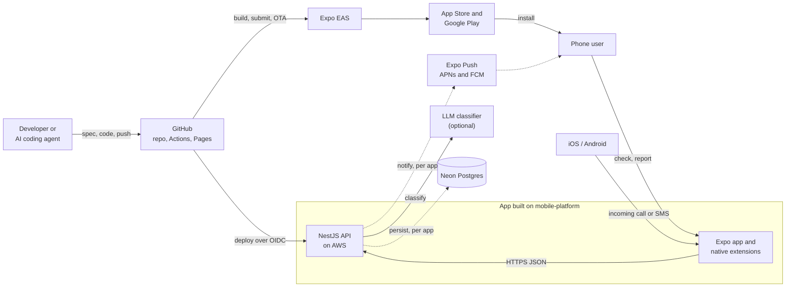
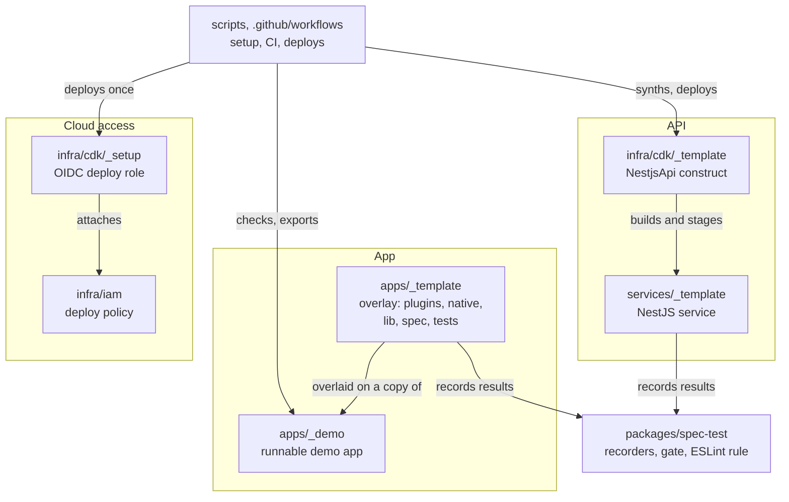
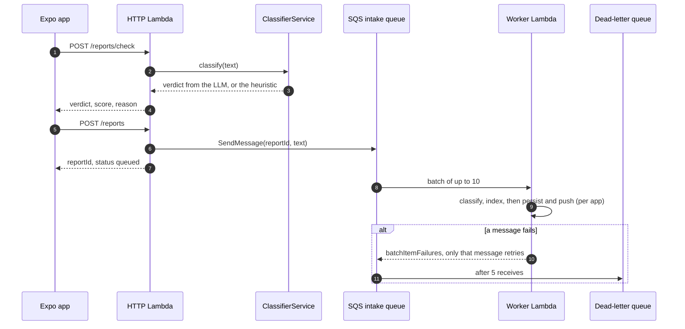
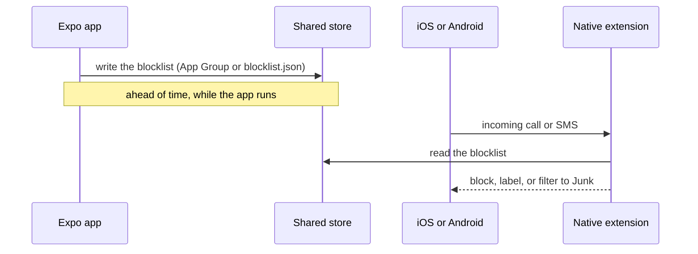
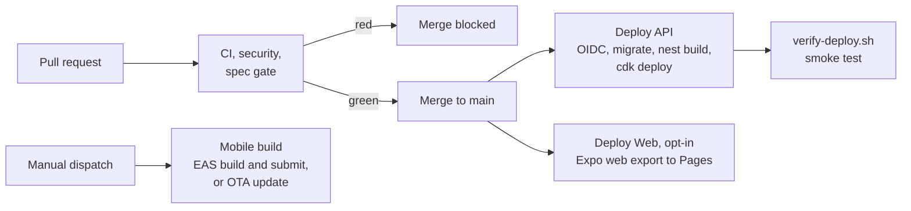
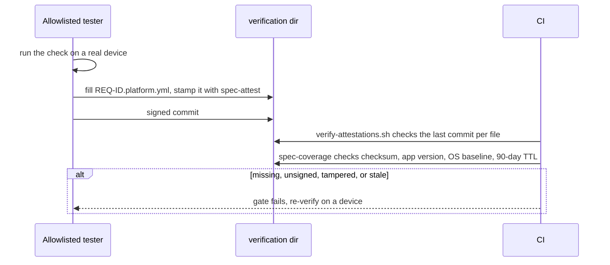
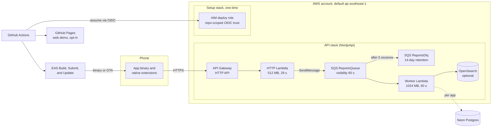

# mobile-platform

A platform-layer template for shipping an Expo (React Native) app with a NestJS API on AWS serverless. Point an AI coding agent at a clone, describe an idea, and it ships a live app and API with native call and SMS interception, async report intake, keyless deploys, and a spec gate that proves even OS-level behavior.

- Live demos and the full story: https://elleskay.github.io/platform-site/
- Web-only apps: use the sibling [platform](https://github.com/elleskay/platform) template.
- Building an app: start at [docs/SETUP.md](docs/SETUP.md).

This README is the architecture documentation, structured with [arc42](https://arc42.org). The system is the template itself; sections 3, 6, and 7 also describe the runtime an app built on it ships into. Detail lives in [docs/](docs/).

## Contents

1. [Introduction and Goals](#1-introduction-and-goals)
2. [Architecture Constraints](#2-architecture-constraints)
3. [System Scope and Context](#3-system-scope-and-context)
4. [Solution Strategy](#4-solution-strategy)
5. [Building Block View](#5-building-block-view)
6. [Runtime View](#6-runtime-view)
7. [Deployment View](#7-deployment-view)
8. [Cross-cutting Concepts](#8-cross-cutting-concepts)
9. [Architecture Decisions](#9-architecture-decisions)
10. [Quality Requirements](#10-quality-requirements)
11. [Risks and Technical Debt](#11-risks-and-technical-debt)
12. [Glossary](#12-glossary)

---

## 1. Introduction and Goals

mobile-platform is the cross-cutting layer every app on it inherits: an Expo app overlay with native call and SMS extensions, a NestJS API scaffold, a reusable CDK construct, a spec-driven test gate, and the CI/CD that ships them. Business logic lives in each app's own repo, cloned from this one (ScamShield is the reference app).

### 1.1 Requirements Overview

| ID  | Requirement                                                                                                                            |
| --- | -------------------------------------------------------------------------------------------------------------------------------------- |
| F1  | Scaffold an app, a service, and the infra from the template; ship the app through EAS and the API to AWS.                              |
| F2  | Surface native call blocking and SMS filtering through Expo config plugins, with the OS doing the interception.                        |
| F3  | Deploy the API with one construct: HTTP Lambda, SQS report intake with a dead-letter queue, an idempotent worker, optional OpenSearch. |
| F4  | Gate every requirement on a passing, asserting test or a fresh, signed real-device artifact.                                           |
| F5  | Wire the keyless GitHub-to-AWS connection with one command.                                                                            |
| F6  | Self-test: platform CI builds the demo app and the service, synths the construct, and exercises the gate.                              |

Out of scope by design: non-serverless APIs, importing the platform as a versioned package, web-only concerns, and app business logic.

### 1.2 Quality Goals

| Priority | Goal         | Meaning here                                                                                                    |
| -------- | ------------ | --------------------------------------------------------------------------------------------------------------- |
| 1        | Provability  | Nothing ships unproven, including OS-level behavior that no JavaScript test can run.                            |
| 2        | Security     | No long-lived cloud credentials, a least-privilege deploy role, nothing secret in the app bundle.               |
| 3        | Reliability  | Report intake survives retries and failures: at-least-once delivery, idempotent processing, a dead-letter path. |
| 4        | Independence | Each app is self-contained; a platform change reaches it only through an explicit pull.                         |
| 5        | Cost         | Near-zero idle cost: pay-per-request compute, paid extras off by default.                                       |

### 1.3 Stakeholders

| Stakeholder                   | Expectation                                                                                                               |
| ----------------------------- | ------------------------------------------------------------------------------------------------------------------------- |
| AI coding agent               | Deterministic scaffolding, written conventions ([CLAUDE.md](CLAUDE.md)), and one gate that says when the work is done.    |
| App owner                     | Reviews the spec (the gate cannot catch a wrong one), provides the database and EAS/store logins, signs native artifacts. |
| Release and security reviewer | Owns infra, workflows, the OS baseline, and the signer allow-list through CODEOWNERS.                                     |
| App end users                 | Scam calls and texts are blocked or filtered by the OS, even when the app is closed.                                      |
| App Store and Play reviewers  | A documented, legitimate anti-scam use for the call and SMS entitlements and roles.                                       |

---

## 2. Architecture Constraints

| Constraint                                                                                                                                                                                              | Consequence                                                                                                                                       |
| ------------------------------------------------------------------------------------------------------------------------------------------------------------------------------------------------------- | ------------------------------------------------------------------------------------------------------------------------------------------------- |
| Call and SMS interception exist only as OS extension points (iOS Call Directory and Message Filter, Android `CallScreeningService` and the call-screening / default-SMS roles), invoked out of process. | Native Swift and Kotlin are unavoidable. JavaScript only manages data, and no JavaScript test can prove the feature.                              |
| Expo managed workflow (SDK 51, React Native 0.74, React 18.2).                                                                                                                                          | `ios/` and `android/` are generated by `expo prebuild`, never committed; native code enters through config plugins.                               |
| Each iOS extension needs its own App ID, entitlements, and provisioning profile. Apple grants the SMS-filter entitlement. Message Filter does not run on the simulator.                                 | iOS extensions cannot be proven in CI without Apple credentials.                                                                                  |
| AWS serverless: Lambda (`nodejs22.x`, ARM64), API Gateway HTTP API, SQS.                                                                                                                                | 10 MB request bodies (attachments go to S3 by presigned URL), 250 MB unzipped bundles, handlers must be root-level files with no dot in the name. |
| `nest build` emits CommonJS.                                                                                                                                                                            | An ESM-only dependency crashes Lambda init; prefer the global `fetch` or a dynamic `import()`.                                                    |
| `EXPO_PUBLIC_*` values are inlined into the app bundle; the CDK environment is baked at synth.                                                                                                          | Only public values go in `EXPO_PUBLIC_*`. Config changes need a rebuild or a redeploy.                                                            |
| EAS Update ships JavaScript and assets only.                                                                                                                                                            | New permissions, extensions, or native dependencies need a store build.                                                                           |
| Node 22+ everywhere (root `engines`, CI, Lambda runtime), TypeScript strict.                                                                                                                            | One toolchain across app, API, and infra.                                                                                                         |
| Template model: cloned per app, pieces copied rather than imported. Mobile and NestJS only.                                                                                                             | Upgrades are explicit pulls. Web-only concerns belong in the web sibling.                                                                         |
| Spec-driven protocol ([CLAUDE.md](CLAUDE.md)): spec first, tests and code together, green gate before done.                                                                                             | Every feature starts as a requirement ID.                                                                                                         |

---

## 3. System Scope and Context

### 3.1 Business Context

```mermaid
flowchart LR
  Dev["Developer or<br/>AI coding agent"]
  User["Phone user"]
  OS["iOS / Android"]
  subgraph Sys["App built on mobile-platform"]
    App["Expo app and<br/>native extensions"]
    API["NestJS API<br/>on AWS"]
  end
  GH["GitHub<br/>repo, Actions, Pages"]
  EAS["Expo EAS"]
  Stores["App Store and<br/>Google Play"]
  LLM["LLM classifier<br/>(optional)"]
  DB[("Neon Postgres")]
  Push["Expo Push<br/>APNs and FCM"]

  Dev -->|"spec, code, push"| GH
  GH -->|"deploy over OIDC"| API
  GH -->|"build, submit, OTA"| EAS
  EAS --> Stores
  Stores -->|"install"| User
  User -->|"check, report"| App
  OS -->|"incoming call or SMS"| App
  App -->|"HTTPS JSON"| API
  API -->|"classify"| LLM
  API -.->|"persist, per app"| DB
  API -.->|"notify, per app"| Push
  Push -.-> User
```

| Neighbor              | Role                                                                                       |
| --------------------- | ------------------------------------------------------------------------------------------ |
| Developer or AI agent | Writes the spec, tests, and code; runs `npm run setup`; pushes.                            |
| GitHub                | Hosts the repo. Actions runs CI, the gate, and deploys; Pages hosts the optional web demo. |
| Expo EAS              | Builds and signs binaries, submits them to the stores, ships OTA updates.                  |
| iOS and Android       | Invoke the native extensions on incoming calls and messages.                               |
| LLM classifier        | Optional scam verdicts. The API falls back to a heuristic without it.                      |
| Neon Postgres         | Database. Setup wires the connection; each app adds persistence.                           |
| Expo Push             | Delivers notifications through APNs and FCM; each app adds sending.                        |

### 3.2 Technical Context

| Channel                  | Protocol                                                                                                   |
| ------------------------ | ---------------------------------------------------------------------------------------------------------- |
| App to API               | HTTPS JSON to an API Gateway HTTP API. Base URL from `EXPO_PUBLIC_API_URL`, `Authorization: Bearer <JWT>`. |
| App to native extensions | No bridge. Shared state: iOS App Group `UserDefaults`, Android `<filesDir>/blocklist.json`.                |
| HTTP Lambda to SQS       | AWS SDK v3 `SendMessage`.                                                                                  |
| SQS to worker Lambda     | Event source mapping: batches of 10, 5 s batching window, partial-batch failure reporting.                 |
| API to classifier        | HTTPS `POST {CLASSIFIER_API_URL}/classify` with a bearer key.                                              |
| Worker to OpenSearch     | HTTPS REST on the `scam-reports` index.                                                                    |
| GitHub Actions to AWS    | OIDC web identity into a repo-scoped IAM role, 1 hour sessions. No stored keys.                            |
| GitHub Actions to EAS    | `EXPO_TOKEN` secret.                                                                                       |

---

## 4. Solution Strategy

### 4.1 Technology

| Layer      | Choice                                                                                      |
| ---------- | ------------------------------------------------------------------------------------------- |
| App        | Expo SDK 51 (React Native 0.74), Expo Router, TypeScript strict                             |
| Native     | Swift (Call Directory, Message Filter), Kotlin (`CallScreeningService`), via config plugins |
| API        | NestJS 10 on Lambda behind an API Gateway HTTP API, class-validator DTOs                    |
| Messaging  | SQS with a dead-letter queue                                                                |
| Search     | OpenSearch, optional, for clustering similar reports                                        |
| Data       | Neon Postgres (Prisma 6 supported by the construct)                                         |
| Auth       | JWT access tokens issued by the API, stored in expo-secure-store                            |
| Classifier | LLM endpoint with a deterministic heuristic fallback                                        |
| Push       | Expo Push (APNs, FCM)                                                                       |
| IaC        | AWS CDK with the `NestjsApi` construct                                                      |
| Delivery   | EAS Build, Submit, and Update for the app; GitHub Actions and CDK over OIDC for the API     |
| Testing    | `@platform/spec-test` over jest-expo, Vitest, Maestro, and signed real-device artifacts     |
| Tooling    | Node 22+, ESLint 9, Prettier 3, Commitlint (Conventional Commits)                           |

### 4.2 Approach

| Goal or constraint             | Approach                                                                                                                                                                                                         |
| ------------------------------ | ---------------------------------------------------------------------------------------------------------------------------------------------------------------------------------------------------------------- |
| Prove OS-level behavior        | A `verify` level per requirement. `native` and `manual` requirements are proven by committed real-device artifacts that are checksummed, signed, and expire ([ADR 0001](docs/adr/0001-testing-architecture.md)). |
| One honest gate across runners | One runner package, published as both ESM and CJS, records jest-expo, Vitest, and Maestro results to one coverage file. One CLI gate reads it.                                                                   |
| Native code without ejecting   | Expo config plugins inject the extensions at prebuild. Swift and Kotlin live as reference sources.                                                                                                               |
| Reliable intake                | Accept fast, enqueue to SQS, drain with an idempotent worker, park poison messages in a DLQ. The `NestjsApi` construct wires it once for every app.                                                              |
| Keyless deploys                | GitHub OIDC into a repo-scoped role with a least-privilege policy. `scripts/connect.sh` wires it once.                                                                                                           |
| Independence                   | Clone the template per app; copy the construct, service, and spec-test instead of importing them.                                                                                                                |
| Low idle cost                  | Pay-per-request serverless. OpenSearch is off by default.                                                                                                                                                        |
| Run anywhere                   | Every external dependency is optional, so local dev and CI need no cloud (see [8.4](#84-graceful-degradation)).                                                                                                  |

---

## 5. Building Block View

### 5.1 Level 1: The Template

```mermaid
flowchart TB
  subgraph AppSide["App"]
    Demo["apps/_demo<br/>runnable demo app"]
    Tmpl["apps/_template<br/>overlay: plugins, native,<br/>lib, spec, tests"]
  end
  subgraph ApiSide["API"]
    Svc["services/_template<br/>NestJS service"]
    Cdk["infra/cdk/_template<br/>NestjsApi construct"]
  end
  subgraph Access["Cloud access"]
    Setup["infra/cdk/_setup<br/>OIDC deploy role"]
    Iam["infra/iam<br/>deploy policy"]
  end
  Spec["packages/spec-test<br/>recorders, gate, ESLint rule"]
  Ops["scripts, .github/workflows<br/>setup, CI, deploys"]

  Tmpl -->|"overlaid on a copy of"| Demo
  Cdk -->|"builds and stages"| Svc
  Setup -->|"attaches"| Iam
  Tmpl -->|"records results"| Spec
  Svc -->|"records results"| Spec
  Ops -->|"deploys once"| Setup
  Ops -->|"synths, deploys"| Cdk
  Ops -->|"checks, exports"| Demo
```

| Block                  | Responsibility                                                                                                       | Per app                      |
| ---------------------- | -------------------------------------------------------------------------------------------------------------------- | ---------------------------- |
| `apps/_demo/`          | Minimal runnable Expo app: one check screen, web export. The base for a new app.                                     | copy to `apps/app/`          |
| `apps/_template/`      | Overlay: `app.config.ts`, config plugins, Swift/Kotlin sources, `lib/`, spec, tests, Maestro flows, `verification/`. | overlay on `apps/app/`       |
| `services/_template/`  | NestJS API: health, check-and-report, SQS consumer, classifier, OpenSearch client.                                   | copy to `services/api/`      |
| `infra/cdk/_template/` | CDK app: the `NestjsApi` construct and `ApiStack`.                                                                   | rename to `infra/cdk/<app>/` |
| `infra/cdk/_setup/`    | One-time stack: the GitHub OIDC deploy role.                                                                         | deploy once                  |
| `infra/iam/`           | Least-privilege policy attached to that role.                                                                        | as is                        |
| `packages/spec-test/`  | Spec parser, per-runner recorders, coverage gate, artifact tools, ESLint rule.                                       | pinned snapshot              |
| `scripts/`             | `connect.sh` (setup), `verify-deploy.sh` (smoke test), `verify-attestations.sh` (artifact signatures).               | as is                        |
| `.github/workflows/`   | CI, security, API deploy, mobile build, web demo.                                                                    | as is                        |

### 5.2 Level 2: NestJS Service

| Part          | Responsibility                                                                                                                         |
| ------------- | -------------------------------------------------------------------------------------------------------------------------------------- |
| `main.ts`     | Local HTTP server on port 3000.                                                                                                        |
| `lambda.ts`   | HTTP Lambda entry. Bootstraps Nest once per container through serverless-express, with a global `ValidationPipe` and CORS.             |
| `worker.ts`   | SQS worker entry, a root-level re-export of `reports/reports.consumer.ts`.                                                             |
| `health/`     | `GET /health`, used by the smoke test.                                                                                                 |
| `reports/`    | `POST /reports/check` classifies synchronously. `POST /reports` enqueues and returns a `reportId`. The consumer processes SQS batches. |
| `classifier/` | LLM classifier with a heuristic fallback that mirrors the app's offline heuristic.                                                     |
| `search/`     | OpenSearch indexing and similar-report lookup; no-op without an endpoint.                                                              |

### 5.3 Level 2: App Overlay

| Part                                                   | Responsibility                                                                                                                                                            |
| ------------------------------------------------------ | ------------------------------------------------------------------------------------------------------------------------------------------------------------------------- |
| `app.config.ts`                                        | Bundle ids, Android permissions, `expo-build-properties` (cleartext off), and the three native plugins.                                                                   |
| `plugins/withAndroidCallScreening`                     | Registers `ScamCallScreeningService` in the manifest and copies the Kotlin into the app package. Proven: it compiles into the release APK.                                |
| `plugins/withIosCallDirectory`, `withIosMessageFilter` | Stage the Swift; the Call Directory plugin also adds the App Group entitlement. Partial: the extension targets still need `@bacons/apple-targets` and Apple provisioning. |
| `native/`                                              | Reference Swift (Call Directory, Message Filter) and Kotlin (call screening, blocklist store).                                                                            |
| `lib/`                                                 | Typed API client with bearer token, secure token storage (SecureStore on native, localStorage on web), push registration, offline classifier.                             |
| `specs/`, `tests/`, `.maestro/`, `verification/`       | The app's spec and its proof: jest-expo unit and component tests, Maestro journeys, signed native artifacts.                                                              |

### 5.4 Level 2: spec-test

| Part                                                  | Responsibility                                                                                                                                  |
| ----------------------------------------------------- | ----------------------------------------------------------------------------------------------------------------------------------------------- |
| `schema.ts`, `parser.ts`                              | Zod-validated spec YAML: unique IDs, valid `depends_on`, no unknown fields.                                                                     |
| `jest.ts`, `vitest.ts`, `maestro.ts`, `playwright.ts` | Per-runner recorders. Parse `[ID]` from test titles and append results to `.spec-coverage/results.jsonl`; `spec-maestro` ingests Maestro JUnit. |
| `cli.ts`, `verification.ts`, `report.ts`              | `spec-coverage`: compares spec IDs with results and artifacts, checks layer and freshness, writes a report, exits non-zero on any gap.          |
| `attest.ts`                                           | `spec-attest`: stamps or checks an artifact's checksum.                                                                                         |
| `eslint-rule.ts`                                      | `require-expect-in-spec-test`: an `[ID]` test without `expect()` fails lint.                                                                    |

---

## 6. Runtime View

### 6.1 Check and Report a Message

```mermaid
sequenceDiagram
  autonumber
  participant App as Expo app
  participant Http as HTTP Lambda
  participant Cls as ClassifierService
  participant Q as SQS intake queue
  participant W as Worker Lambda
  participant DLQ as Dead-letter queue
  App->>Http: POST /reports/check
  Http->>Cls: classify(text)
  Cls-->>Http: verdict from the LLM, or the heuristic
  Http-->>App: verdict, score, reason
  App->>Http: POST /reports
  Http->>Q: SendMessage(reportId, text)
  Http-->>App: reportId, status queued
  Q->>W: batch of up to 10
  W->>W: classify, index, then persist and push (per app)
  alt a message fails
    W-->>Q: batchItemFailures, only that message retries
    Q->>DLQ: after 5 receives
  end
```

Requests reach the HTTP Lambda through API Gateway. Without `REPORTS_QUEUE_URL` (local dev, CI) the service processes the report inline, so the journey still runs end to end.

### 6.2 A Scam Call or SMS Arrives

```mermaid
sequenceDiagram
  participant App as Expo app
  participant Store as Shared store
  participant OS as iOS or Android
  participant Ext as Native extension
  App->>Store: write the blocklist (App Group or blocklist.json)
  Note over App,Store: ahead of time, while the app runs
  OS->>Ext: incoming call or SMS
  Ext->>Store: read the blocklist
  Ext-->>OS: block, label, or filter to Junk
```

The app does not need to be running. No JavaScript runner sees this path, so its requirements are `verify: native` and proven on a real device ([8.2](#82-native-evidence)).

### 6.3 Change to Production

```mermaid
flowchart LR
  PR["Pull request"] --> Gate["CI, security,<br/>spec gate"]
  Gate -->|"red"| Blocked["Merge blocked"]
  Gate -->|"green"| Main["Merge to main"]
  Main --> Api["Deploy API<br/>OIDC, migrate, nest build,<br/>cdk deploy"]
  Api --> Smoke["verify-deploy.sh<br/>smoke test"]
  Main --> Web["Deploy Web, opt-in<br/>Expo web export to Pages"]
  Dispatch["Manual dispatch"] --> Mobile["Mobile build<br/>EAS build and submit,<br/>or OTA update"]
```

The smoke test checks health, a live classification, validation (empty body and unknown field both get 400), a queued report, and that no secret leaks. The merge block relies on branch protection, a manual GitHub setting ([11](#11-risks-and-technical-debt)).

### 6.4 Prove a Native Requirement

```mermaid
sequenceDiagram
  participant T as Allowlisted tester
  participant V as verification dir
  participant CI as CI
  T->>T: run the check on a real device
  T->>V: fill REQ-ID.platform.yml, stamp it with spec-attest
  T->>V: signed commit
  CI->>V: verify-attestations.sh checks the last commit per file
  CI->>V: spec-coverage checks checksum, app version, OS baseline, 90-day TTL
  alt missing, unsigned, tampered, or stale
    CI-->>T: gate fails, re-verify on a device
  end
```

---

## 7. Deployment View

### 7.1 Infrastructure

```mermaid
flowchart LR
  subgraph Phone["Phone"]
    AppBin["App binary and<br/>native extensions"]
  end
  subgraph AWS["AWS account, default ap-southeast-1"]
    subgraph ApiStack["API stack (NestjsApi)"]
      GW["API Gateway<br/>HTTP API"]
      HttpFn["HTTP Lambda<br/>512 MB, 29 s"]
      Queue["SQS ReportsQueue<br/>visibility 60 s"]
      Dlq["SQS ReportsDlq<br/>14-day retention"]
      WorkerFn["Worker Lambda<br/>1024 MB, 60 s"]
      Search[("OpenSearch<br/>optional")]
    end
    subgraph SetupStack["Setup stack, one-time"]
      Role["IAM deploy role<br/>repo-scoped OIDC trust"]
    end
  end
  Neon[("Neon Postgres")]
  EASCloud["EAS Build, Submit,<br/>and Update"]
  Actions["GitHub Actions"]
  Pages["GitHub Pages<br/>web demo, opt-in"]

  AppBin -->|"HTTPS"| GW
  GW --> HttpFn
  HttpFn -->|"SendMessage"| Queue
  Queue --> WorkerFn
  Queue -->|"after 5 receives"| Dlq
  WorkerFn --> Search
  WorkerFn -.->|"per app"| Neon
  Actions -->|"assume via OIDC"| Role
  Actions --> EASCloud
  EASCloud -->|"binary or OTA"| AppBin
  Actions --> Pages
```

| Building block                 | Deployed as                                                                                                                           |
| ------------------------------ | ------------------------------------------------------------------------------------------------------------------------------------- |
| Expo app and native extensions | EAS binary through the App Store and Google Play. JavaScript-only changes ship as EAS Update OTA.                                     |
| `services/api`                 | One asset (`nest build` output plus production `node_modules`), two Lambdas: `lambda.handler` and `worker.handler`. Node 22 on ARM64. |
| `NestjsApi` construct          | CloudFormation stack, default id `AppApi`, renamed per app. Outputs the API URL, the queue URL, and the OpenSearch endpoint.          |
| `_setup` stack and IAM policy  | CloudFormation stack `PlatformSetup-<owner>-<repo>`, once per AWS account and repo. Role `github-actions-<repo>`, 1 hour sessions.    |
| Web demo                       | Static Expo web export on GitHub Pages.                                                                                               |

Construct defaults: SQS enforces TLS; logs are kept 14 days; OpenSearch, when enabled, is one `t3.small.search` node with 10 GB gp3, encryption at rest and in transit, and HTTPS only.

### 7.2 Pipelines

| Workflow                                    | Trigger                | What it does                                                                                                                                                                                                                         |
| ------------------------------------------- | ---------------------- | ------------------------------------------------------------------------------------------------------------------------------------------------------------------------------------------------------------------------------------ |
| `ci.yml`                                    | PR, push to `main`     | actionlint; typecheck, lint, format, and tests across workspaces; Expo doctor (advisory), prebuild dry-run, and web export of `apps/_demo`; `nest build`; `cdk synth`; gate and ESLint rule self-tests; attestation guard self-test. |
| `security.yml`                              | PR, push, weekly       | CodeQL, gitleaks, `npm audit` (advisory).                                                                                                                                                                                            |
| `deploy-api.yml`                            | Push to `main`, manual | OIDC, database migrations if `db/migrate.ts` exists, `nest build`, `cdk deploy --all`, smoke test. Staging or production on manual runs. Skips without `AWS_DEPLOY_ROLE_ARN`.                                                        |
| `mobile-build.yml`                          | Manual                 | EAS build (optional store submit) or EAS Update, per profile. Skips without `EXPO_TOKEN`.                                                                                                                                            |
| `deploy-web.yml`                            | Push to `main`         | Expo web export to GitHub Pages. Skips unless `WEB_DEMO=true`.                                                                                                                                                                       |
| `apps/_template/.github/workflows/test.yml` | Copied into each app   | Lint and jest-expo on every push; attestations; on PRs, Maestro journeys on a KVM Android emulator against a release APK and the real API on the host.                                                                               |

### 7.3 Configuration

- Set by `npm run setup`: secrets `AWS_DEPLOY_ROLE_ARN`, `DATABASE_URL`, `JWT_SECRET` (plus `EXPO_TOKEN` and `CLASSIFIER_API_KEY` if passed); variables `AWS_REGION`, `JWT_ISSUER`, `ENABLE_OPENSEARCH` (plus `CDK_DIR`, `API_DIR`, `CLASSIFIER_API_URL` if non-default). See [docs/SETUP.md](docs/SETUP.md).
- Set by hand for the web demo: `WEB_DEMO`, `DEMO_API_URL`, optionally `APP_DIR`. See [docs/MOBILE.md](docs/MOBILE.md).
- Injected by the construct: `REPORTS_QUEUE_URL`, `OPENSEARCH_ENDPOINT`.

Rollback: redeploy the previous commit for the API; promote a previous EAS build or republish a known-good OTA bundle for the app ([docs/DEPLOY.md](docs/DEPLOY.md)).

---

## 8. Cross-cutting Concepts

### 8.1 Spec-driven Verification

Each requirement in `specs/<app>.yml` has an ID (`<APP>-<DOMAIN>-<NNN>`), a category, a severity, given/when/then, and a `verify` level. A test proves it by carrying `[ID]` in its title (or its Maestro flow `name`); every runner records to one coverage file.

| `verify`                  | Proven by                                                    |
| ------------------------- | ------------------------------------------------------------ |
| `unit`                    | jest-expo (app) or Vitest (API)                              |
| `component`               | jest-expo with React Native Testing Library                  |
| `integration`, `contract` | An automated test at that level (layers planned in ADR 0001) |
| `e2e`                     | A Maestro flow, ingested by `spec-maestro`                   |
| `native`, `manual`        | A signed real-device artifact in `verification/`             |

`spec-coverage` fails on an uncovered requirement, a failing test, a result in the wrong layer, or a missing, unsigned, tampered, or stale artifact. The ESLint rule fails any `[ID]` test without `expect()`. The gate cannot catch a wrong spec, unspecced behavior, or a broken link between separately covered requirements, so every user-facing feature also ships a journey-level e2e. Detail: [docs/TESTING.md](docs/TESTING.md).

### 8.2 Native Evidence

- One artifact per native or manual requirement per platform: app version, OS tested, device, date, tester, evidence link, signature.
- **Integrity:** `signature` is a `sha256` over the canonical body, stamped by `spec-attest`. An edit after stamping reads as `tampered`.
- **Accountability:** the last commit touching an artifact must be signed by someone in `verification/allowed-signers`. `scripts/verify-attestations.sh` fails closed, and signed artifacts with an empty allow-list exit 2.
- **Freshness:** stale when the app version moves past the tested one, the tested OS falls behind `verification/os-baseline.yml`, or 90 days pass. Re-verify once per release or every 90 days, whichever comes first.

### 8.3 Security

- **Keyless deploys:** GitHub OIDC into a role whose trust is pinned to `repo:<owner>/<name>:*`, with 1 hour sessions and the policy in `infra/iam/cdk-deploy-policy.json` instead of `AdministratorAccess`.
- **Secrets:** only in GitHub Actions secrets, Lambda environment, and EAS secrets. Everything in the app binary, `EXPO_PUBLIC_*` included, is public.
- **Transport:** TLS only. iOS ATS on; Android cleartext off through `expo-build-properties` (the Expo `android.usesCleartextTraffic` key is a no-op).
- **Input:** class-validator DTOs behind a global `ValidationPipe` with `whitelist` and `forbidNonWhitelisted`.
- **Tokens:** short-lived JWTs in expo-secure-store (Keychain, Keystore), never AsyncStorage.
- **Supply chain:** CodeQL, gitleaks, `npm audit`, weekly Dependabot (framework majors held back), and CODEOWNERS on infra, workflows, and native verification governance.

Per-app controls (Helmet, guards, rate limiting, error tracking): [docs/SSDLC.md](docs/SSDLC.md).

### 8.4 Graceful Degradation

Every external dependency is optional, so the same code runs on a laptop, in CI, and in production.

| Missing                                     | Behavior                                                                                |
| ------------------------------------------- | --------------------------------------------------------------------------------------- |
| `REPORTS_QUEUE_URL`                         | The report is processed inline.                                                         |
| Classifier URL or key, or an LLM error      | The deterministic heuristic answers.                                                    |
| `OPENSEARCH_ENDPOINT`                       | Indexing and search no-op.                                                              |
| EAS project id                              | Push registration returns null.                                                         |
| Native platform (running on web)            | Token storage falls back to localStorage; `DeviceFrame` frames the UI.                  |
| Deploy secrets, `EXPO_TOKEN`, or `WEB_DEMO` | The API deploy, mobile build, and web workflows skip in preflight, so forks stay green. |

### 8.5 Idempotent Intake

SQS delivers at least once. The worker keys its work on `reportId`, reports per-message failures (`reportBatchItemFailures`) so successes are not re-run, and SQS moves a message to the DLQ after 5 receives.

### 8.6 Lambda Packaging

- The bundle is the `nest build` (tsc) output plus production `node_modules`. No esbuild: it drops the decorator metadata NestJS DI needs, and the app boots with every injected service undefined.
- The runtime provides the AWS SDK; the construct strips the unused ESM copies of `@aws-sdk` and `@smithy` to stay under 250 MB.
- Handlers are root-level files (`lambda.handler`, `worker.handler`). A nested or dotted handler path fails init.
- The Nest app is bootstrapped once per container and reused across warm invocations.
- With Prisma, the construct generates the `linux-arm64-openssl-3.0.x` engine into the bundle and strips the rest. Pin Prisma 6.

### 8.7 When Configuration Is Fixed

| Value               | Fixed at                             |
| ------------------- | ------------------------------------ |
| `EXPO_PUBLIC_*`     | App build (inlined, public)          |
| Lambda environment  | `cdk synth`                          |
| Native capabilities | Store build (OTA cannot change them) |

---

## 9. Architecture Decisions

The formal record is [ADR 0001: spec-driven testing architecture](docs/adr/0001-testing-architecture.md) (accepted 2026-05-29). The table summarizes it alongside the decisions recorded in code and docs, with the alternatives each one beat.

| Decision                                                                     | Rejected alternatives                                   | Why                                                                                                            |
| ---------------------------------------------------------------------------- | ------------------------------------------------------- | -------------------------------------------------------------------------------------------------------------- |
| Prove native behavior with signed, expiring real-device artifacts (ADR 0001) | Mark it covered; manual QA each release                 | The first lies. The second is unenforced and untied to the build.                                              |
| An explicit `verify` level per requirement (ADR 0001)                        | Category doubles as the proving layer                   | Implicit and unauditable.                                                                                      |
| Maestro for e2e, jest-expo for unit and component (ADR 0001)                 | Detox                                                   | e2e is journey smoke once the native layer carries the hard part; Maestro is low-flake YAML on both platforms. |
| One dual-published runner, one coverage record                               | Per-runner coverage; a naming convention alone          | No single source of truth, and nothing enforces the convention.                                                |
| Expo config plugins for native code                                          | Eject to the bare workflow; patch files after prebuild  | Ejecting loses the managed workflow and OTA. Patches drift and break silently.                                 |
| SQS, an idempotent worker, and a DLQ                                         | Process inline; finish in the background after replying | Inline makes the user wait and loses reports on failure. Lambda can freeze once the response is sent.          |
| Release APK driven by Maestro on a KVM emulator                              | Debug APK; Metro in CI                                  | A debug build needs Metro to load its JavaScript. Running Metro in CI is slow and flaky.                       |
| No iOS e2e job                                                               | macOS runners                                           | Critical iOS behavior is proven in the native layer, so the cost is not justified yet.                         |
| `nest build` plus `node_modules` as the Lambda asset                         | esbuild bundle                                          | Bundling breaks NestJS dependency injection.                                                                   |
| Copy, don't import                                                           | A published platform package                            | A breaking change lands only when an app pulls it.                                                             |
| Serverless only, OpenSearch off by default                                   | Containers; always-on search                            | Near-zero idle cost. A domain is not free and takes about 15 minutes to create or delete.                      |

---

## 10. Quality Requirements

### 10.1 Quality Tree

| Quality     | Refined into                                        | Scenarios  |
| ----------- | --------------------------------------------------- | ---------- |
| Provability | coverage, assertion quality, layer, native evidence | QS1 to QS5 |
| Security    | credentials, input handling                         | QS6, QS7   |
| Reliability | retry isolation, duplicate delivery                 | QS8, QS9   |
| Performance | warm starts                                         | QS10       |
| Operability | unconfigured forks, cloud-free CI                   | QS11, QS12 |
| Cost        | idle spend                                          | QS13       |

### 10.2 Quality Scenarios

| ID   | Stimulus                                                                                                       | Expected response                                                    |
| ---- | -------------------------------------------------------------------------------------------------------------- | -------------------------------------------------------------------- |
| QS1  | A requirement has no passing test.                                                                             | `spec-coverage` exits 1; the work is not done.                       |
| QS2  | A test titled `[ID]` asserts nothing.                                                                          | Lint fails before tests run.                                         |
| QS3  | A `ui` requirement is covered only by a unit test.                                                             | Category mismatch, exit 1.                                           |
| QS4  | A native artifact was tested on an older app version or OS than the current ones, or is more than 90 days old. | Stale, exit 1, until re-verified on a device.                        |
| QS5  | Someone edits an artifact after stamping, or commits it unsigned.                                              | The gate reports `tampered`; `verify-attestations.sh` fails.         |
| QS6  | A workflow in another repo tries to assume the deploy role.                                                    | STS denies it: the trust policy matches only this repo.              |
| QS7  | A request carries an unknown field.                                                                            | 400, checked by the post-deploy smoke test.                          |
| QS8  | One message in a batch of 10 throws.                                                                           | Only that message is retried; after 5 receives it lands in the DLQ.  |
| QS9  | SQS delivers the same report twice.                                                                            | No duplicate side effects: writes are keyed on `reportId`.           |
| QS10 | A warm invocation arrives.                                                                                     | It reuses the cached Nest app; no re-bootstrap.                      |
| QS11 | A fresh fork with no secrets pushes to `main`.                                                                 | Deploy workflows skip; CI stays green.                               |
| QS12 | CI runs with no AWS credentials, classifier, or OpenSearch.                                                    | The API works end to end with inline processing and the heuristic.   |
| QS13 | The API sees no traffic.                                                                                       | No always-on compute is billed; OpenSearch stays off unless enabled. |

---

## 11. Risks and Technical Debt

| Risk or debt                                                                                                                                          | Impact                                                                                                  | Mitigation                                                                                              |
| ----------------------------------------------------------------------------------------------------------------------------------------------------- | ------------------------------------------------------------------------------------------------------- | ------------------------------------------------------------------------------------------------------- |
| The iOS config plugins stage the Swift (and the App Group entitlement) but do not create the extension targets.                                       | iOS call and SMS features need manual target setup and are unproven in CI.                              | `@bacons/apple-targets` plus Apple provisioning per app; native artifacts prove the result on a device. |
| Decomposed-journey gaps.                                                                                                                              | 100% coverage while the feature is dead in the field, for example an SMS filter that was never enabled. | One journey e2e per user-facing feature and a real-device check before release.                         |
| A wrong or missing spec entry.                                                                                                                        | Tests agree with a wrong requirement.                                                                   | Human review of spec changes.                                                                           |
| OS baseline upkeep is manual.                                                                                                                         | An OS release changes CallKit or SMS behavior with no app bump.                                         | The 90-day TTL backstop and CODEOWNERS review of baseline bumps. A reminder job is planned.             |
| The deploy policy is broad on the services it uses (`lambda:*`, `sqs:*`, `s3:*` on all resources).                                                    | A larger blast radius if the role is misused.                                                           | Trust pinned to one repo, 1 hour sessions. Tighten resource ARNs for production.                        |
| The service is a scaffold: persistence (deduped on `reportId`), JWT issuing, push sending, authorization, rate limiting, and Helmet are per-app work. | A clone is not production-ready as is.                                                                  | [docs/SSDLC.md](docs/SSDLC.md) lists what each app must add.                                            |
| The contract (`packages/contracts`) and integration (Testcontainers) layers from ADR 0001 are not built.                                              | The app-to-API seam is covered only by e2e journeys.                                                    | Sequenced in ADR 0001.                                                                                  |
| Deploy API runs on every push to `main`; it does not wait for the gate.                                                                               | A red gate blocks deploys only if branch protection blocks the merge.                                   | Require the checks in branch protection, and make each app's deploy depend on its gate.                 |
| The OpenSearch client uses unsigned `fetch`.                                                                                                          | A real domain needs SigV4 signing.                                                                      | Swap in `@opensearch-project/opensearch` with SigV4 before production use.                              |
| No iOS e2e.                                                                                                                                           | iOS-only journey bugs can slip through.                                                                 | Add a nightly macOS Maestro job if they appear.                                                         |
| Expo SDK 51 and React Native 0.74 are pinned; Dependabot holds majors back.                                                                           | Store target-SDK requirements eventually force an upgrade.                                              | Upgrade the Expo set together with `expo install --fix`, never piecemeal.                               |
| Some checks are advisory: `npm audit`, `expo-doctor`, and the per-push spec report in the app test workflow.                                          | Findings do not block merges.                                                                           | Make them blocking when ready. The authoritative merged gate runs at release.                           |

---

## 12. Glossary

| Term                   | Meaning                                                                                                      |
| ---------------------- | ------------------------------------------------------------------------------------------------------------ |
| Spec                   | `specs/<app>.yml`: the app's requirements, each with an ID and a `verify` level.                             |
| Requirement ID         | `<APP>-<DOMAIN>-<NNN>`, for example `EX-SMS-001`. Tests carry it as `[ID]` in their title.                   |
| Verify level           | How a requirement must be proven: `unit`, `component`, `integration`, `contract`, `e2e`, `native`, `manual`. |
| Spec gate              | `spec-coverage`, the CLI that exits non-zero on any unproven requirement.                                    |
| Verification artifact  | Signed YAML in `verification/` that proves a native or manual requirement on a real device.                  |
| OS baseline            | `verification/os-baseline.yml`: the OS versions an app claims to handle. Older artifacts are stale.          |
| Allowed signers        | `verification/allowed-signers`: who may attest, in SSH allowed-signers format.                               |
| Journey e2e            | A Maestro flow across the whole user path (UI, API, receipt).                                                |
| Decomposed-journey gap | Every requirement of a feature is covered, but the chain between them is broken.                             |
| Config plugin          | A function that edits the generated native projects during `expo prebuild`.                                  |
| Overlay                | Files from `apps/_template/` copied onto an app made from `apps/_demo/`.                                     |
| EAS                    | Expo Application Services: Build, Submit, and Update.                                                        |
| OTA                    | Over-the-air JavaScript and asset update through EAS Update. Cannot change native code.                      |
| Call Directory         | iOS CallKit extension that blocks or labels numbers.                                                         |
| Message Filter         | iOS `ILMessageFilterExtension` that sorts SMS from unknown senders.                                          |
| `CallScreeningService` | Android service the OS binds to screen calls once the app holds the call-screening role.                     |
| App Group              | iOS container shared by the app and its extensions.                                                          |
| `NestjsApi`            | The CDK construct: API Gateway, HTTP Lambda, SQS with a DLQ, worker Lambda, optional OpenSearch.             |
| OIDC deploy role       | The IAM role GitHub Actions assumes with a short-lived token instead of stored keys.                         |
| DLQ                    | Dead-letter queue: where a message goes after 5 failed receives.                                             |

## License

MIT. See [LICENSE](LICENSE).
